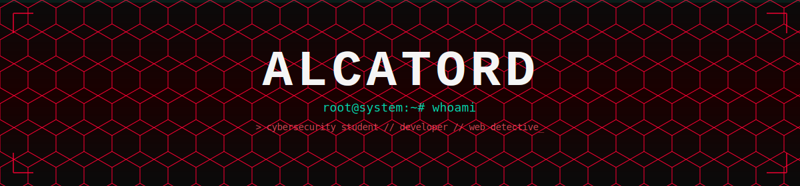
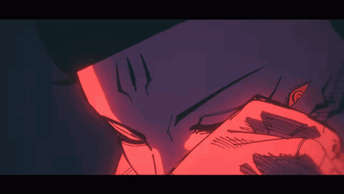
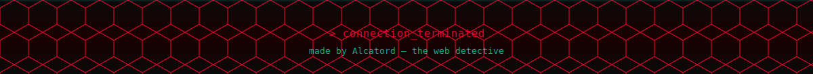

<div align="center">




</div>

<br/>

```bash
┌──(root/system)-[~]
└─$ whoami

alca
├── role      : cybersecurity student & software developer
├── location  : undisclosed // encrypted
├── stack     : python, c, c++, javascript, full-stack web
├── focus     : network security | osint | hardware hacking | tool building
└── status    : ONLINE — building Workspace Pro
```

<br/>

## connect

<div align="center">

[](https://instagram.com/Alca_Tord)
[](https://tiktok.com/@mr_alcatord_x)
[](https://x.com/Alcatord)
[](https://www.youtube.com/@Mr.Alcatord)

</div>

<br/>

## tech stack

<div align="center">


</div>

<br/>

## focus areas

<div align="center">

| security | networking &#124; osint | hardware hacking | dev tools |
|:---:|:---:|:---:|:---:|
| Vulnerability research | Network scanning & mapping | Radio / RF hacking | Desktop apps (PySide6) |
| Web app security | OSINT tooling & recon | SDR experimentation | Python automation |
| Hash cracking | Traffic analysis (Wireshark) | Arduino prototyping | REST APIs |
| Exploit analysis | Protocol inspection | Raspberry Pi projects | Full-stack web dev |

</div>

<br/>

## stats

<div align="center">




</div>

<br/>

<div align="center">

```
> "My plan was not to hurt you." —
```



</div>
